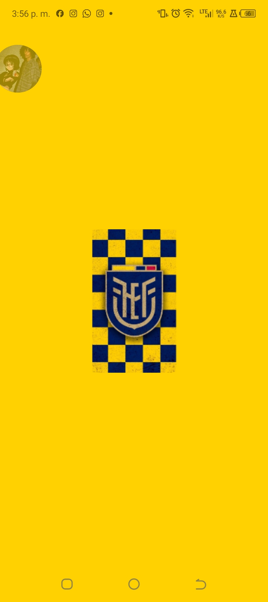

## 🚀 Cómo Instalarlo

### Opción 1: Instalar el APK en Android (Recomendado)
Para una experiencia completa y nativa, puedes descargar e instalar la aplicación compilada directamente en tu dispositivo Android mediante el siguiente enlace:

📥 **[Descargar e Instalar APK Oficial de Tri GO](https://expo.dev/accounts/leviathan19/projects/TriGO/builds/357995e2-43e0-411c-ac0d-90174b89a6d1)**

*Nota: Es posible que necesites habilitar la instalación de aplicaciones de "Fuentes Desconocidas" en la configuración de seguridad de tu dispositivo.*# Tri GO 🇪🇨⚽

**Tri GO** es una aplicación móvil desarrollada para los verdaderos hinchas de la Selección Ecuatoriana de Fútbol ("La Tri"). El aplicativo permite explorar de manera interactiva la ruta histórica mundialista de Ecuador, ofreciendo detalles de cada una de sus participaciones en la máxima cita del fútbol mundial.

---

## 🎯 ¿Para qué sirve?
El principal propósito de la aplicación es documentar y rendir homenaje a la trayectoria de Ecuador en las Copas Mundiales de la FIFA. Sirve como una enciclopedia interactiva y visual donde los usuarios pueden recordar los hitos de la selección, los técnicos al mando y las plantillas oficiales que representaron al país en cada torneo.

## ✨ ¿Qué se puede hacer?
- **Explorar la Línea de Tiempo:** Navegar a través de los años en los que la selección clasificó al Mundial (2002, 2006, 2014, 2022 y la futura participación en 2026).
- **Ver Detalles por Mundial:** Tocar la tarjeta de un año específico para ver una reseña histórica detallada.
- **Consultar la Plantilla Oficial:** Revisar el listado completo de jugadores, sus respectivos números de dorsal y sus posiciones.
- **Revisar Enfrentamientos:** Conocer los partidos disputados en cada mundial junto a sus marcadores finales y goleadores ecuatorianos.
- **Disfrutar de un Diseño Inmersivo:** Animaciones personalizadas (como el balón de fútbol indicativo) e interfaces intuitivas que rescatan los colores tradicionales de la selección.

---

## 🛠️ Especificaciones Técnicas (Con qué fue hecho)
- **Framework Principal:** [React Native](https://reactnative.dev/)
- **Herramientas de Desarrollo:** [Expo SDK](https://expo.dev/)
- **Navegación:** [Expo Router](https://docs.expo.dev/router/introduction/) (Enrutamiento basado en archivos).
- **Estilos:** Hojas de estilos dinámicas utilizando los estándares de React Native (`StyleSheet`).
- **Lenguaje:** TypeScript / JavaScript (ES6+).
- **Animaciones:** Integración de `react-native-reanimated` para micro-interacciones (ej: el balón rotando).
- **Assets:** Manejo optimizado de imágenes a través del componente `Image` de `expo-image`.

---
### Opción 2: Correr localmente con Expo
Si deseas probar el entorno de desarrollo o explorar el código:
1. Clona este repositorio o extrae el código fuente.
2. Abre una terminal en la raíz del proyecto.
3. Instala las dependencias:
   ```bash
   npm install
   ```
4. Inicia el servidor de desarrollo:
   ```bash
   npm run start
   ```
5. Escanea el código QR desde la aplicación **Expo Go** instalada en tu dispositivo móvil.

---

## 📱 Vistas de la Aplicación

A continuación, capturas de pantalla de la aplicación ejecutándose en el dispositivo:

### Pantalla de Carga (Splash Screen)


### Interfaz Principal (Línea de Tiempo)


### Detalles del Mundial (Plantilla y Enfrentamientos)


### Aplicación instalada en el dispositivo


---

## 🎨 Activos Visuales Originales

### Logo de la Aplicación


### Activo Base del Splash Screen


---

## ⚠️ Nota Importante sobre el Splash Screen en Expo Go

Si pruebas la aplicación utilizando el cliente de **Expo Go** en tu celular (Opción 2), notarás que la pantalla de carga amarilla con el logo (Splash Screen) no se muestra correctamente, sino que verás la de Expo por defecto. 

Esto sucede porque la aplicación de Expo Go no está compilada con nuestro código nativo. Para que Expo Go intente mostrar nuestro diseño durante la carga inicial en el entorno de desarrollo, tuvimos que configurar la sección manual en el archivo `app.json`, agregando el objeto de esta manera:

```json
"splash": {
  "image": "./assets/images/fonts_tri/splashScreen.png",
  "resizeMode": "contain",
  "backgroundColor": "#FFD100"
}
```

*Sin embargo, la mejor manera de visualizar el comportamiento 100% real del Splash Screen es instalando el APK en Android (Opción 1).*
