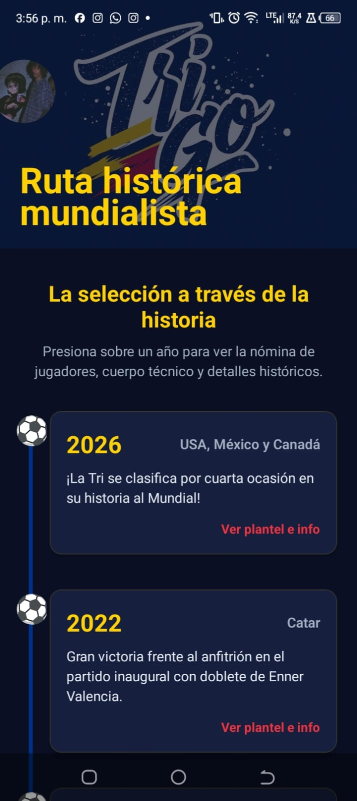
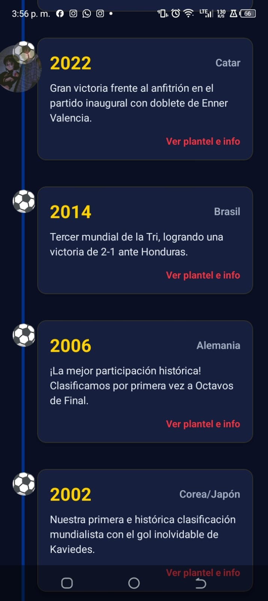
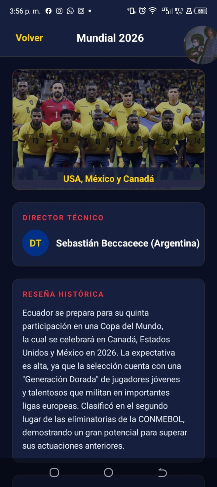
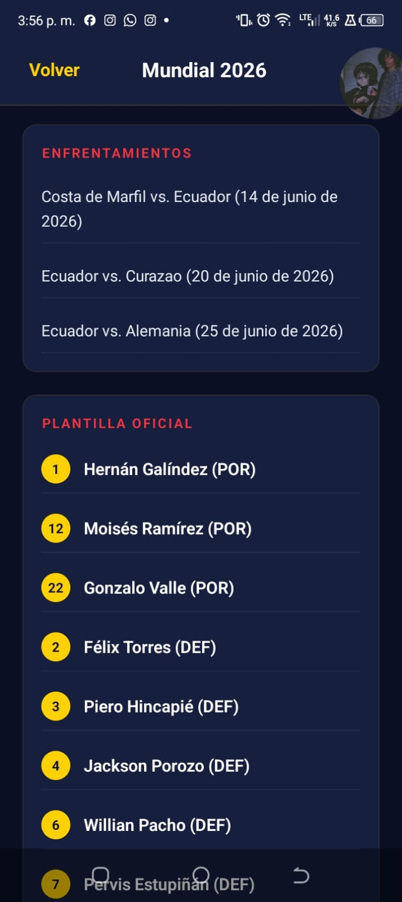
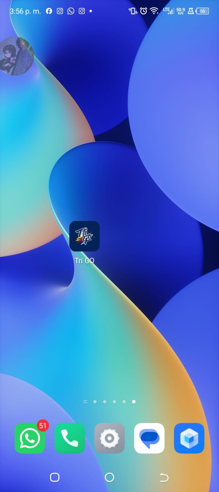
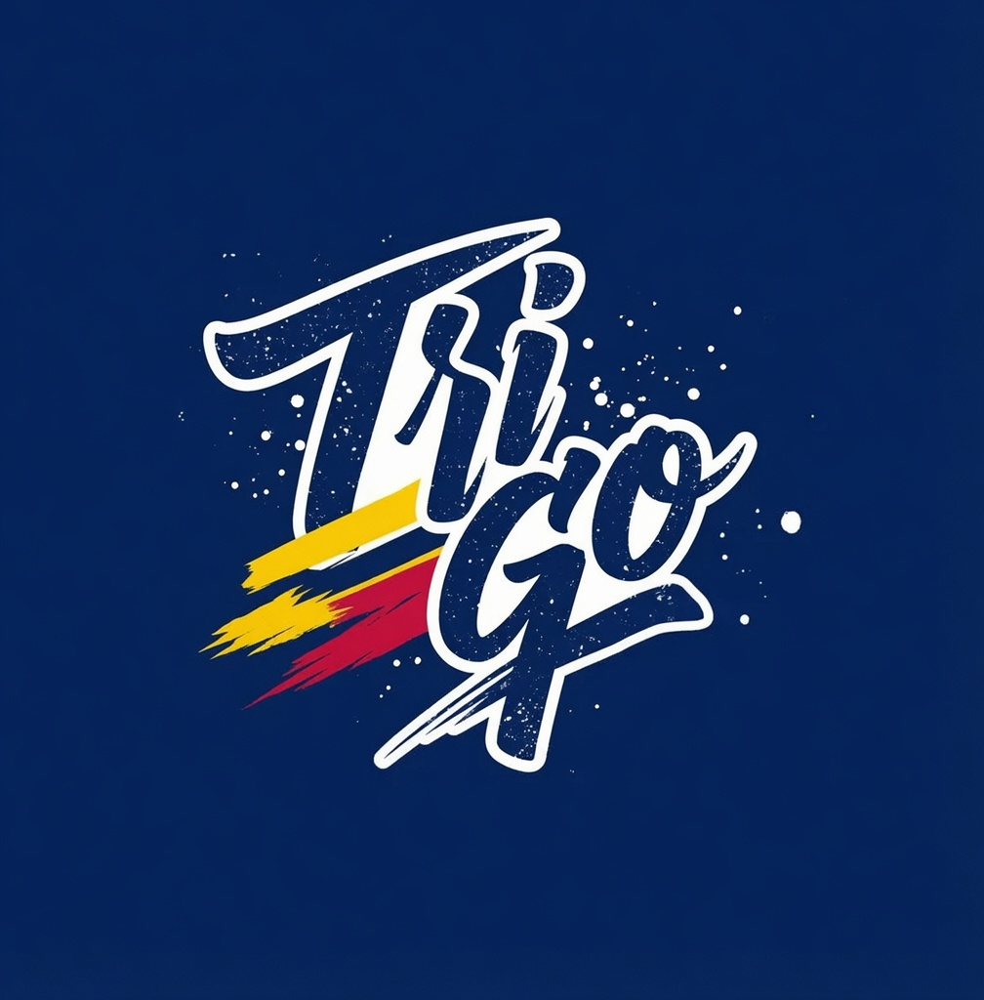
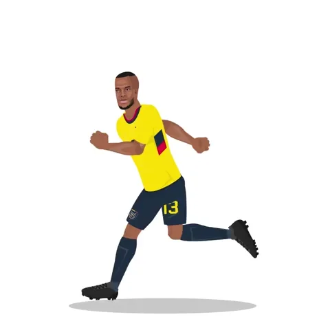

# Tri GO 🇪🇨⚽
## 🚀 Cómo Instalarlo

### Opción 1: Instalar el APK en Android (Recomendado)
Para una experiencia completa y nativa, puedes descargar e instalar la aplicación compilada directamente en tu dispositivo Android mediante el siguiente enlace:

📥 **[Descargar e Instalar APK Oficial de Tri GO](https://expo.dev/accounts/leviathan19/projects/TriGO/builds/e9573a74-609f-4724-a597-ec3cf684db99)**

*Nota: Es posible que necesites habilitar la instalación de aplicaciones de "Fuentes Desconocidas" en la configuración de seguridad de tu dispositivo.*

### Opción 2: Correr localmente con Expo
Si deseas probar el entorno de desarrollo o explorar el código:
1. Clona este repositorio o extrae el código fuente.
2. Abre una terminal en la raíz del proyecto.
3. Instala las dependencias:
   ```bash
   npm install
   ```
4. Inicia el servidor de desarrollo:
   ```bash
   npm run start
   ```
5. Escanea el código QR desde la aplicación **Expo Go** instalada en tu dispositivo móvil.

**Tri GO** es una aplicación móvil desarrollada para los verdaderos hinchas de la Selección Ecuatoriana de Fútbol ("La Tri"). El aplicativo permite explorar de manera interactiva la ruta histórica mundialista de Ecuador, ofreciendo detalles de cada una de sus participaciones en la máxima cita del fútbol mundial.

---

## 🎯 ¿Para qué sirve?
El principal propósito de la aplicación es documentar y rendir homenaje a la trayectoria de Ecuador en las Copas Mundiales de la FIFA. Sirve como una enciclopedia interactiva y visual donde los usuarios pueden recordar los hitos de la selección, los técnicos al mando y las plantillas oficiales que representaron al país en cada torneo.

## ✨ ¿Qué se puede hacer?
- **Explorar la Línea de Tiempo:** Navegar a través de los años en los que la selección clasificó al Mundial (2002, 2006, 2014, 2022 y la futura participación en 2026).
- **Ver Detalles por Mundial:** Tocar la tarjeta de un año específico para ver una reseña histórica detallada.
- **Consultar la Plantilla Oficial:** Revisar el listado completo de jugadores, sus respectivos números de dorsal y sus posiciones.
- **Revisar Enfrentamientos:** Conocer los partidos disputados en cada mundial junto a sus marcadores finales y goleadores ecuatorianos.
- **Disfrutar de un Diseño Inmersivo:** Animaciones personalizadas (como el balón de fútbol indicativo y la secuencia de inicio animada) e interfaces intuitivas que rescatan los colores tradicionales de la selección.

---

## 🛠️ Especificaciones Técnicas (Con qué fue hecho)
- **Framework Principal:** [React Native](https://reactnative.dev/)
- **Herramientas de Desarrollo:** [Expo SDK](https://expo.dev/)
- **Navegación:** [Expo Router](https://docs.expo.dev/router/introduction/) (Enrutamiento basado en archivos).
- **Estilos:** Hojas de estilos dinámicas utilizando los estándares de React Native (`StyleSheet`).
- **Lenguaje:** TypeScript / JavaScript (ES6+).
- **Animaciones:** Integración de `react-native-reanimated` para micro-interacciones.
- **Assets:** Manejo optimizado de imágenes a través del componente `Image` de `expo-image`.

---

## 📱 Vistas de la Aplicación

A continuación, capturas de pantalla de la aplicación ejecutándose en el dispositivo:

### Interfaz Principal (Línea de Tiempo)



### Detalles del Mundial (Plantilla y Enfrentamientos)



### Aplicación instalada en el dispositivo


---

## 🎨 Activos Visuales Originales

### Logo de la Aplicación


### Escudo de la Selección (Splash Screen Nativo)


### Animación de Introducción (GIF)


---

## ℹ️ Explicación Técnica: Secuencia de Inicio (Splash Screen y GIF)

La aplicación cuenta con una transición de inicio personalizada, dividida en dos fases programadas para brindar una experiencia fluida al usuario final:

### Fase 1: El Splash Screen Nativo (Sistema Operativo)
Mientras el dispositivo prepara la aplicación en su memoria, Android exige que se muestre una pantalla de carga nativa (reglas de la Splash Screen API). Esta pantalla se compone obligatoriamente de dos partes separadas:
1. **El Fondo (`backgroundColor`):** Si el desarrollador no define ningún color explícito, el sistema rellenará el fondo de color blanco o negro (dependiendo si el celular está configurado en modo claro u oscuro). En esta app, nosotros predefinimos un color sólido amarillo (`#FFD100`).
2. **El Logo Central (`image`):** Si no se escoge un logo para el medio de la pantalla, Android tomará por defecto el ícono externo (el que tocas para abrir la app). Para mejorar el diseño, decidimos inyectar explícitamente el escudo de la selección.

Esta primera fase oficial se mantiene a la vista durante los primeros 2.5 segundos.

### Fase 2: La Pantalla de Introducción (El GIF)
Inmediatamente después de que la pantalla amarilla nativa se oculta, entra en acción nuestro código en React. En lugar de mandar al usuario directamente al menú principal, hemos programado una pantalla de introducción interceptora en el archivo de ruteo (`_layout.tsx`).

El usuario es recibido por un elegante fondo azul marino donde flota un **GIF animado de Enner Valencia** celebrando. Mediante un temporizador interno de 5 segundos, la aplicación obliga a que termine la celebración antes de navegar automáticamente al *Home* (la línea de tiempo interactiva).
